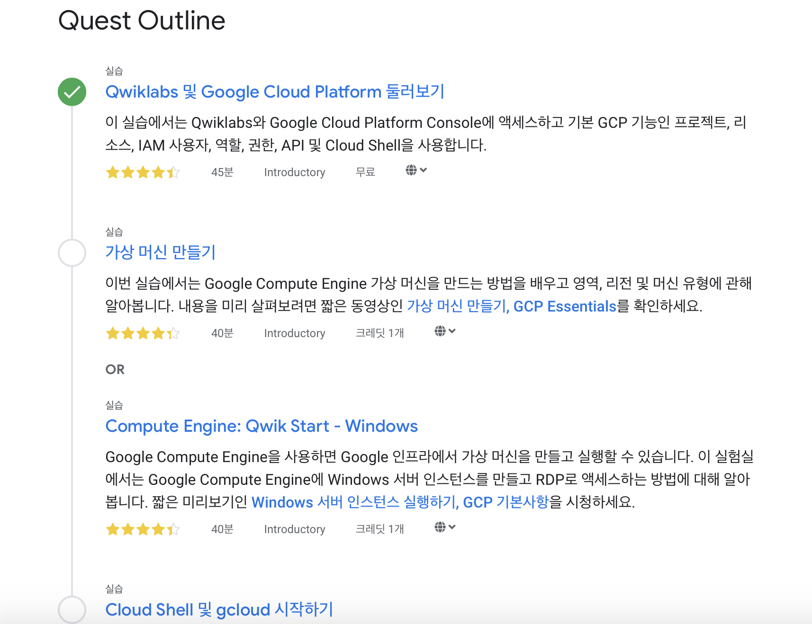
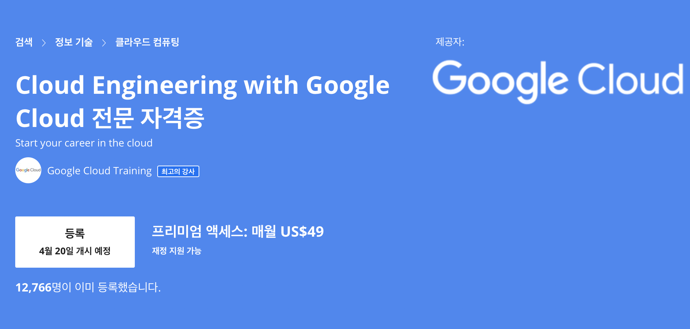

코로나로 힘든 시기, 구글이 알찬 시간을 보낼 수 있도록 Google Cloud 교육을 30일동안 무료로 풀었습니다 👏
 
4월 30일까지 등록해야 무료로 들을 수 있어요. 관련링크: <https://gc.hosting.kr/blog-bitly-googlecloud-2/>

 

온라인 교육 플랫폼 [Pluralsight](https://www.pluralsight.com), [Coursera](https://www.coursera.org/professional-certificates/cloud-engineering-gcp) 그리고 [Qwiklabs](https://google.qwiklabs.com/?qlcampaign=1m-freelabs-543) 이렇게 3곳에서 강의를 들을 수 있는데
저는 구글 클라우드가 익숙치 않아 Qwiklabs의 Google Cloud Essentials부터 시작했어요.

Qwiklabs만 한국어가 지원됩니다.

---

이런식으로 7개의 실습 위주이고 시간이 정해져있어서 집중해서 할 수 있었습니다.

예전에 AWS를 처음 사용할 때 너무너무 어렵고 메뉴도 많고 보안키도 조심해야하는 점들이 클라우드에 대한 진입장벽을 높였는데 이렇게 다시 해보니 그 때 경험해보길 잘한 것 같아요.
구조와 용어들이 반가웠어요 🧐

 

일단 Qwiklabs부터 시작해서 Coursera의 Cloud Engineering with Google Cloud까지 계획하고 있어요.
 
Coursera는 GCP 자격증을 중심으로 진행되는 것 같아요.

두 강의를 후다닥 들은 뒤 GCP 자격증 준비를 하려고 합니다.

 
 
하나의 클라우드 플랫폼 자격증을 가지고 있는 것보단 두개 이상을 가지고 있으면 시장에서 유리할 것 같아요. 
AWS는 많은 분들이 갖고 계시고 GCP도 점점 늘어나고 있어요.

| Google Cloud             | Amazon Web Service   | Azure                       |
| ------------------------ | -------------------- | --------------------------- |
| Associate Cloud Engineer | Cloud Practitioner   | Azure Fundamentals          |
| Cloud Architect          | Solutions Architect  | Administrator Associate     |
| Cloud Developer          | SysOps Administrator | Data Engineer Associate     |
| Data Engineer            | Developer            | Security Engineer Associate |
| Cloud Developer          | -                    | AI Engineer Associate       |

 

기본 수준의 자격증부터 시작해서 프로페셔널 자격증까지 갖고 있으면 좋을 것 같아 하나씩 딸 예정입니다

### ✅ 참고 문서

- Google Cloud blog: <https://gc.hosting.kr/blog-bitly-googlecloud-2/>
- Google Cloud: <https://cloud.google.com/certification?hl=ko>
- AWS Certification: <https://aws.amazon.com/ko/certification/?nc2=sb_ce_co>
- Microsoft Certification: <https://www.microsoft.com/ko-kr/learning/browse-all-certifications.aspx?certificationtype=role-based>
