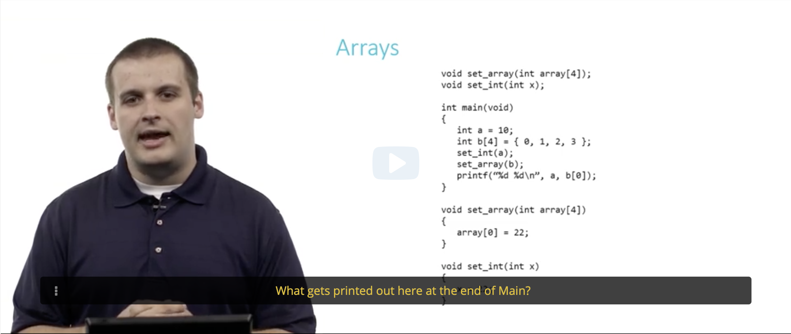
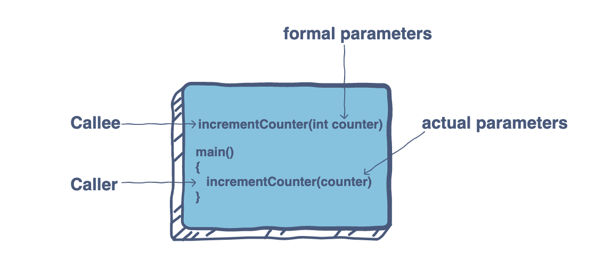
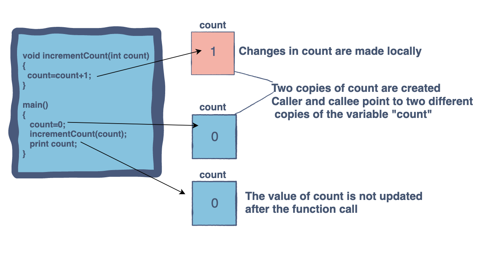
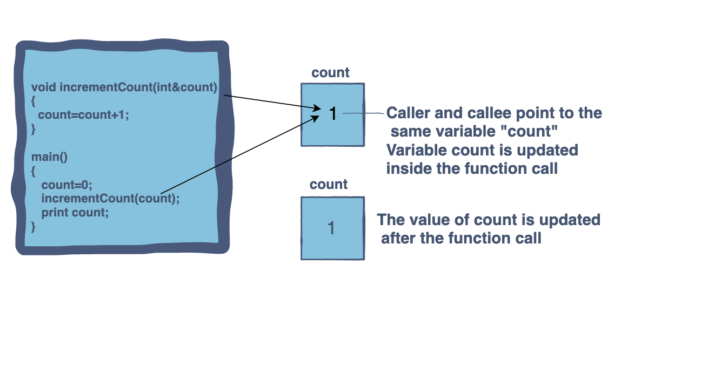

- edx에서 CS50 Computer Science 수업을 듣던 중 fucntion과 array에 다룬 내용을 복습합니다.

<br>
C언어의 기초부터 다루는 이 수업에서 Array가 매번 이해되지 않았어요. 연습문제까지 안 풀려서 이해하기 위해 노력했습니다.
<br>
<br>

👇해당 연습문제👇
<br>



자막에 적힌대로 main의 결과를 맞추는 문제인데, 저는 22 22를 생각했어요. 제 답은 반은 맞았지만 아직 array의 성질을 이해하지 못했어요 🥺

<br>

### function과 array의 차이

**function: passed an argument by value (copy the value)**

**array: passed an argument by reference (Not copy the value)**

<br>
강의에서 말한 내용을 참고하자면

- Recall that most variables in C are passed by value in function calls.
- Arrays do not follow this rule, Rather, they are passed by reference. The callee receives the actual array, not a copy of it.

<br>
더 확실한 이해를 위해 그림 설명을 찾아봤어요.

<br>

</img><br/>

## Pass by value

</img><br/>

```
void set_int(int x)
```

강의 연습문제의 **set_int** function은 pass by value의 예로, 같은 값(value)에 각각 독립 변수(variables)를 갖고 있습니다.  
그래서 a의 출력값은 int a = 10과 동일하게 10이 됩니다.
<br>

## Pass by reference (Pass by address)

</img><br/>

```
void set_array(int array[4])
```

강의 연습문제의 **set_array** function은 array이기 때문에 pass by reference로 생각해야 합니다. 호출자(caller)와 피호출자(callee)는 같은 변수를 사용합니다.  
function call 후에 b[0]의 출력값은 a처럼 b[0] = 0이 아닌 22가 됩니다.  
<br>

---

제가 듣고 있는 강의는 CS50's Introduction to Computer Science 이에요. 알고리즘을 탄탄히 배우고 싶다면 이 수업을 추천드립니다. ✌️  
무려 하버드 대학🤭 강의이고 CS50 IDE(통합개발환경)도 있어서 코드 실습이 간편해요.  
<br>

### ✅ 참고 문서

- CS50's Introduction to Computer Science: <https://www.edx.org/course/cs50s-introduction-to-computer-science>
- Pass by value vs. pass by reference: <https://www.educative.io/edpresso/pass-by-value-vs-pass-by-reference>
